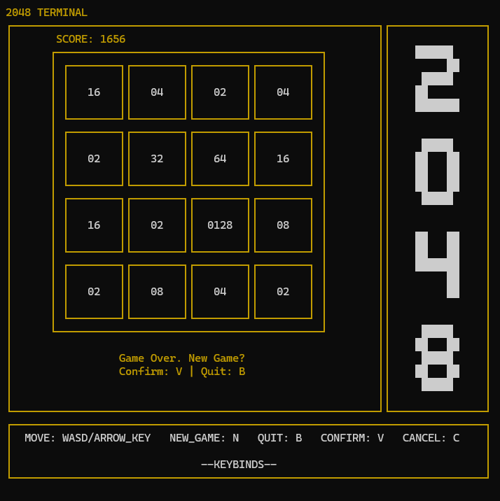

# Terminal-2048

2048 in the terminal.



## How to install/play?

Make sure you have:
- Python

For Windows users, you must install `windows-curses` in your python environment.

To install `windows-curses`, use the following command:
```
python -m pip install windows-curses
```
To run the code, navigate to the directory with the terminal and run:
```
python main.py
```
Make sure to resize your terminal large enough for the game BEFORE you run `python main.py`.
